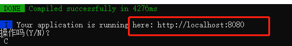
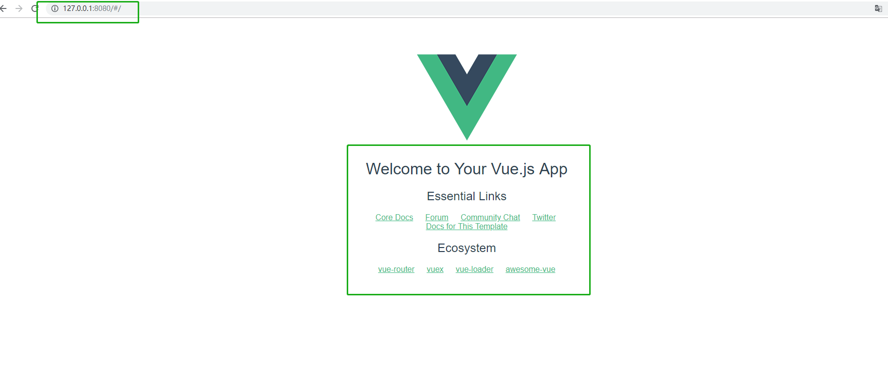

Vue 依赖于Node.js
===
#### 安装步骤如下
---
1. 在node官网下载安装包 https://nodejs.org/en/，选择win 64位 .mis结尾的安装包（个人认为方便安装，更易懂）
2. 可寻找历史安装包，听说node10 版本以下的安装依赖能够稳定一些，作为初学者，安装的是9.8.0 的node.js
3. 一路默认安装完成，node自带npm。但是npm调用的是国外的源，下载慢，下面我安装了cnpm，国内淘宝源下载包快。
4.  node –v    查看node版本

    npm –v     查看npm版本
5. 现在我们来考虑这样一个问题：一般我们的系统盘（C盘）的空间就有限，安装太多的node工具后，我们的系统盘越来越下了，能不能把这两个目录移到别的盘去呢？答案是肯定的！npm允许我们自己配置这两个目录的，那咱们开始吧！

```
打开cmd命令行窗口，分别运行以下三个命令

npm config set prefix="D:\node\npm"

npm config set cache="D:\node\npm-cache"

npm config ls

前两个命令用于设置，第三个命令用于查看设置信息
```

6. 重新设置npm安装包的路径到用户环境变量Path中

    Path: D:\node\npm

7. 最后，不要忘了将原先的用户目录下的npm和npm-cache目录删除

8. 安装一个新的node包叫cnpm
```
npm install -g cnpm --registry=https://registry.npm.taobao.org
```
9. 安装vue

```
cnpm install --global vue-cli
vue init webpack my-project
cd my-project
cnpm install
cnpm run dev
```
##### note：安装完vue后，找到vue.cmd位置，加入环境变量中

效果展示



本地端口8080 出现页面：

